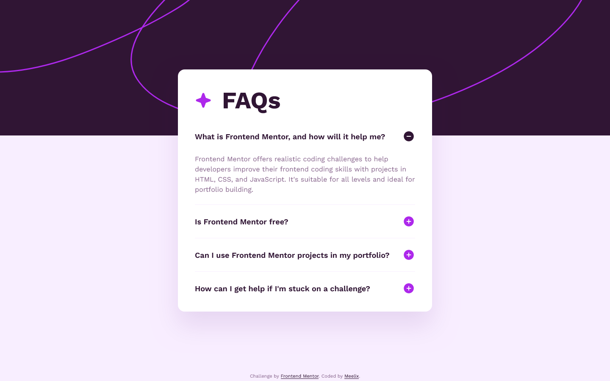

# Frontend Mentor - FAQ accordion solution

This is a solution to the [FAQ accordion challenge on Frontend Mentor](https://www.frontendmentor.io/challenges/faq-accordion-wyfFdeBwBz). Frontend Mentor challenges help you improve your coding skills by building realistic projects.

## The challenge

Users should be able to:

- [x] Hide/Show the answer to a question when the question is clicked
- [x] Navigate the questions and hide/show answers using keyboard navigation alone
- [x] View the optimal layout for the interface depending on their device's screen size
- [x] See hover and focus states for all interactive elements on the page

## Screenshot

## Links

- Solution URL: [Add solution URL here](https://your-solution-url.com)
- Live Site URL: [Add live site URL here](https://your-live-site-url.com)

## My process

### Built with

- Semantic HTML5 markup
- CSS custom properties
- Native nested css
- Mobile-first workflow
- Vanilla css, js, html

### What I learned

Nothing, just solidified my knowledge

### Useful resources

- [Transfonter](https://transfonter.org/) - Usefull to reduce font file sizes.

## Acknowledgments

I was to lazy write the js myself so is used Quentin Roy's solution https://stackoverflow.com/a/36994802
